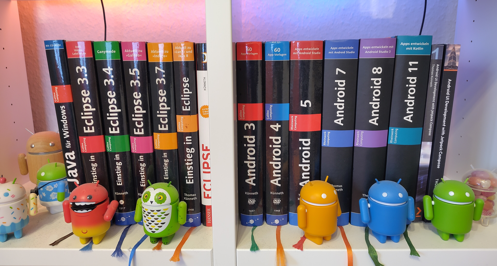

<html>

I enjoy writing articles and books. So far, I published four book titles:

<ul>
<li><em>Android UI Development with Jetpack Compose</em> is my latest book. Its second edition has been publicly available since November 3, 2023. To learn more about it, kindly have a look at the <a href="https://www.packtpub.com/product/android-ui-development-with-jetpack-compose-second-edition/9781837634255">publisher's website</a>. All samples are available on <a href="https://github.com/PacktPublishing/Android-UI-Development-with-Jetpack-Compose-Second-Edition">GitHub</a>.</li>
<li>My first book was called <em>Java für Windows</em>. It's written in German and was published in 2006. By then, Java was very popular on the Mac. Apps tried to look as native as possible. The book explains how to achieve something similar on Windows, that is, do things that are not possible with Java out of the box. If you are up for some nostalgia, you can read the <a href="assets/727.pdf">complete book</a> for free.</li>
<li>My second book is a thorough introduction to the <em>Eclipse</em> IDE. It's also written in German. The first five editions were published by Galileo Computing / Rheinwerk, the final edition by Hanser.</li>
<li>The third book (also written in German) is an Android developers handbook. More than 70 examples illustrate various aspects of the platform and corresponding APIs. The book was published in six editions. The last one covers Android 11. It is available for free on the <a href="https://openbook.rheinwerk-verlag.de/android11/">publisher's website</a>.</li>

</ul>

</html>
