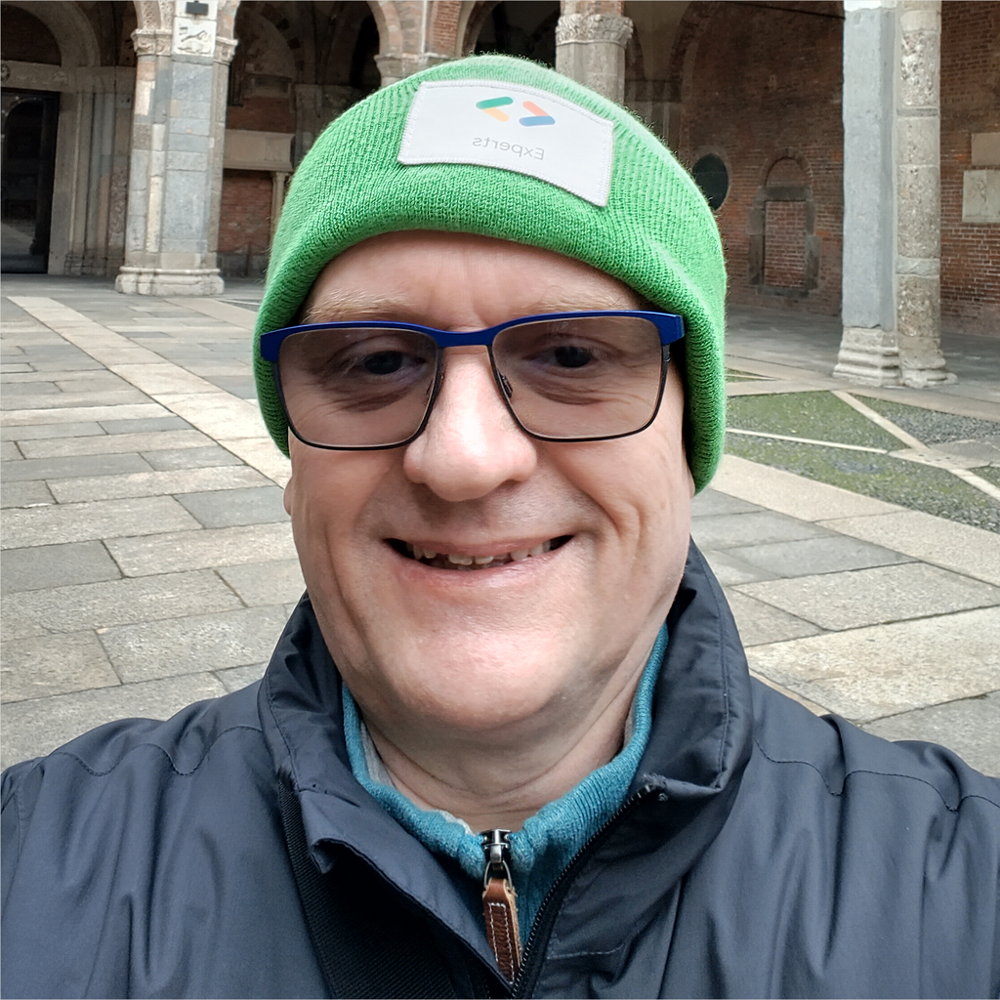

<html>

<h3>Hi there. I'm Thomas, a software engineer</h3>

Being a child of the 1970s, my first encounter with programming was in the era of home computers. Those tiny machines (mine was a Laser 210) were usually fed with BASIC, the first programming language I learned. Later came C, Perl and a few more.

During the 1990s I wrote a bunch of programs for the Atari ST series. The first decade of my professional career was (inevitably) Java. Today it’s mostly Kotlin.

I fell in love with Android in 2009 and have been contributing to the community since then. Since April 2021, I am a <a href="https://developers.google.com/profile/u/tkuenneth?hl=en">Google Developer Export for Android</a>.

As of today, I have written four books (15 editions) and countless articles. I enjoy talking at conferences and meetups, both local and international ones.

</html>